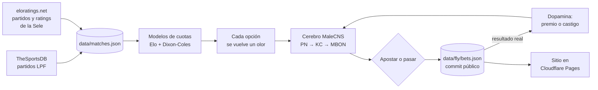

# La Mosca

**Le di B/. 20 a un cerebro de mosca para que apueste en el fútbol panameño.**

La Mosca es una simulación pública y autónoma: un cerebro construido a partir de neuronas reales de *Drosophila melanogaster* decide, cada mañana, cómo apostar en partidos reales de la Liga Panameña de Fútbol (LPF) y de la Selección de Panamá. Gana, pierde y aprende como aprende una mosca. El dinero es ficticio; todo lo demás se puede verificar.

**Sitio:** https://la-mosca.pages.dev

---

## En resumen

| | |
| --- | --- |
| **Cerebro** | 296 neuronas reales del cuerpo pedunculado (el centro de aprendizaje de la mosca) y sus 4.181 conexiones, tomadas del conectoma **MaleCNS v1.0** de HHMI Janelia |
| **Aprendizaje** | La dopamina modifica las sinapsis según cuánto lo sorprendió el resultado, siguiendo el mecanismo descrito en la literatura del cuerpo pedunculado |
| **Cuotas** | Dos modelos probabilísticos (Elo + Poisson Dixon-Coles): uno entrenado con 973 partidos de la LPF y otro con 301 partidos de Panamá |
| **Autonomía** | GitHub Actions corre todo cada día a las 07:00 de Panamá, sin intervención humana |
| **Transparencia** | Cada apuesta queda en el historial público de git **antes** del partido; cada decisión es reproducible |

## Por qué

Proyectos recientes han puesto conectomas de mosca a "jugar" (Beat Saber, blackjack, trading). Quise hacer algo propio y local: llevar un dataset de neurociencia de frontera a algo que cualquier panameño entiende de inmediato, el fútbol del fin de semana, sin perder el rigor sobre qué es real y qué es una decisión de modelado.

## Cómo funciona



1. **El precio.** Un modelo Elo convierte la fuerza de cada equipo en goles esperados, y una distribución Poisson con corrección Dixon-Coles produce la probabilidad de cada marcador. De ahí salen todos los mercados (1X2, más/menos de 2.5, ambos anotan, marcador exacto), cotizados con el 6 % de margen de una casa de apuestas real. Para la Sele, el rating de World Football Elo, con +100 de localía según el país donde se juega, alimenta el mismo modelo de goles, calibrado con la historia de Panamá.
2. **El olor.** La mosca no lee números: cada opción (local, empate, visitante) le llega como un olor, un patrón fijo sobre 48 glomérulos de entrada.
3. **El cerebro.** Ese patrón recorre las conexiones reales: neuronas de proyección (PN), células de Kenyon (KC), de las cuales solo queda activo ~10 %, y neuronas de salida (MBON) que empujan a acercarse o a evitar. La dirección de cada neurona de salida se deriva del propio conectoma.
4. **La decisión.** Elige con algo de azar, más cuanto más audaz está; a veces "se atreve" con la cuota más alta. Si ninguna opción le atrae, no apuesta, y eso también queda registrado.
5. **El aprendizaje.** Al conocer el resultado, la dopamina de premio (neuronas PAM) o de castigo (PPL1) debilita las sinapsis que estaban activas, en proporción a la sorpresa: ganar con un batacazo enseña mucho; ganar con el favorito, poco.

Antes de debutar, la mosca "vivió" en orden cronológico 973 partidos reales de la LPF (2022 a 2026), sin conocer los resultados de antemano, y llega a su debut con preferencias formadas por su propia historia.

## Resultados y validación

Los modelos se evalúan en orden cronológico: cada predicción solo usa partidos anteriores.

| Modelo | Partidos | Log loss 1X2 (menor es mejor) | Referencia |
| --- | --- | --- | --- |
| Cuotas LPF | 973 | **1.059** | 1.093 (frecuencias históricas) |
| Cuotas Selección | 301 | **0.910** | 0.939 (Elo puro) |

| Infancia de la mosca | |
| --- | --- |
| Apuestas | 832 (y 141 partidos que decidió no apostar) |
| Acierto | 36.2 % |
| Retorno | −6.1 % (la casa cobra 6 % de margen: se comporta como un apostador real, no como un oráculo) |
| Quiebras | 3 |

**Calidad de software:** 27 pruebas automatizadas en TypeScript y 9 en Python (extractores científicos, modelos, cerebro, integridad de datos), ejecutadas en cada push. El job diario vuelve a correrlas con los datos nuevos y no publica nada que rompa el sitio.

## Real frente a modelado

| Viene de los datos | Decisión del proyecto |
| --- | --- |
| Identidad, tipo y neurotransmisor de cada neurona | Actividad neuronal y su dinámica |
| Conexiones y número de sinapsis | Codificación de cada opción como olor |
| Morfología 3D de cada neurona | Regla de aprendizaje y "audacia" |
| Partidos, fechas, sedes y resultados | Cuotas, saldo y apuestas |

Metodología completa de la extracción científica en [`MALECNS.md`](./MALECNS.md).

## Limitaciones

- La actividad neuronal es un modelo simplificado (sin potenciales, tiempos biológicos ni inhibición explícita). El proyecto usa conectividad real, pero no afirma reproducir la electrofisiología de la mosca.
- La división entre dopamina de premio y de castigo, y la codificación de los olores, son decisiones de modelado basadas en literatura, documentadas como tales.
- Los partidos de la Selección solo publican fecha (no hora), así que la mosca decide el día anterior.
- Las métricas de los modelos se calcularon con los mismos partidos usados para ajustar sus pocos parámetros (3 a 7), por lo que la mejora real puede ser algo menor.

## La experiencia

- **Escena 3D** (three.js, sin modelos externos): la mosca en su cuarto, frente a una tele que transmite el próximo partido, con Ciudad de Panamá por la ventana. El cielo sigue la hora de quien visita.
- **Su día:** de 00:00 a 05:00 duerme boca arriba en su cama, como Gregorio Samsa; el día de un partido oficial de Panamá está nerviosa; celebra cuando Panamá gana. Cuando juega la Sele, el cuarto se pone rojo.
- **Panel del cerebro:** las 296 neuronas con su forma real, reproduciendo la decisión del día.
- **La libreta:** historial completo, saldo apuesta por apuesta, quiebras y "lo que aprendió esta semana".
- Español e inglés, diseño responsive y soporte para movimiento reducido.

Vistas previas: `?hora=1` (dormida), `?animo=nervous`, `?animo=celebrating`, `?marea=1` (Marea Roja).

## Arquitectura

| Capa | Herramientas |
| --- | --- |
| Frontend | React, TypeScript, Vite, three.js |
| Modelos y cerebro | TypeScript puro, sin dependencias de ML |
| Extracción científica | Python, `neuprint-python` (conectoma MaleCNS) |
| Automatización | GitHub Actions (diario y mensual) |
| Hosting | Cloudflare Pages (sitio estático, sin servidor) |

```text
src/brain/      el cerebro: circuito, olores, decisión, aprendizaje
src/odds/       modelos de cuotas: Elo, Dixon-Coles, Selección
src/football/   fuentes de partidos y su normalización
src/scene/      escena 3D y panel del cerebro
src/site/       páginas y textos (ES/EN)
scripts/        jobs diarios, calibración, extracción científica, tarjeta para compartir
data/           todo lo que la mosca vive, versionado en git
tests/          pruebas de modelos, cerebro, datos y estados de ánimo
```

### Automatización

| Workflow | Cuándo | Qué hace |
| --- | --- | --- |
| `daily.yml` | Todos los días, 07:00 Panamá | Sincroniza partidos, liquida, aprende, apuesta, verifica y publica |
| `monthly.yml` | Día 1 de cada mes | Reentrena ambos modelos de cuotas |
| `ci.yml` | Cada push | Tipos, pruebas, build y revisión de credenciales |

Los commits automáticos los firma **`mosca-bot`**, la identidad de GitHub Actions de estos jobs. Si una corrida falla, el error queda registrado en `data/runs.json`.

### Datos

| Archivo | Contenido |
| --- | --- |
| `data/matches.json` | Base de partidos normalizada; solo crece |
| `data/runs.json` | Bitácora de cada corrida, incluidas las fallidas |
| `data/fly/state.json` | El cerebro: pesos sinápticos, saldo, audacia, rachas |
| `data/fly/bets.json` | Apuestas en vivo y partidos que decidió no apostar |
| `data/fly/upcoming.json` | Próximos partidos ya cotizados |
| `data/fly/tastes.json` | Sus gustos por equipo, con una foto por día |
| `data/fly/infancy.json` y `infancy-bets.json` | Su "infancia": 973 partidos y 832 apuestas |
| `data/model/` | Parámetros y métricas de ambos modelos de cuotas |
| `data/international/ratings.json` | Rating Elo de cada selección, actualizado a diario |
| `data/history/` | Temporadas 2022 a 2024 de la LPF (API-Football) |

## Ejecutarlo localmente

Requiere Node.js 22.12 o superior.

```bash
npm ci
npm run dev
```

| Comando | Qué hace |
| --- | --- |
| `npm run sync:matches` | Sincroniza partidos y ratings (`-- --from AAAA-MM-DD --to AAAA-MM-DD` para reconstruir un rango) |
| `npm run fly:daily` | El día de la mosca: liquidar, aprender, apostar |
| `npm run fly:upcoming` | Recotiza los próximos partidos sin apostar |
| `npm run calibrate:odds` | Reentrena el modelo de la LPF |
| `npm run calibrate:international` | Reentrena el modelo de la Selección |
| `npm run fly:raise` | Vuelve a criar la mosca desde cero (se niega si ya tiene apuestas en vivo) |

Validación completa:

```bash
npm run typecheck
npm test
python -m unittest discover -s scripts -p "test_*.py"
npm run build
```

El sitio no necesita variables de entorno. `NEUPRINT_TOKEN` y `API_FOOTBALL_KEY` solo se usan localmente para regenerar datos científicos e históricos, y nunca forman parte del build.

## Aviso y créditos

Dinero ficticio. Esto no es una casa de apuestas, y no apuestes lo que diga una mosca.

- Datos neuronales: MaleCNS v1.0, HHMI Janelia FlyEM Project, [CC BY 4.0](https://creativecommons.org/licenses/by/4.0/).
- Partidos: [TheSportsDB](https://www.thesportsdb.com/) y [API-Football](https://www.api-football.com/).
- Selecciones: [World Football Elo Ratings](https://www.eloratings.net/).
- Tipografías: Big Shoulders Display y Atkinson Hyperlegible (SIL Open Font License).

El proyecto selecciona y transforma estos datos; no implica respaldo de sus autores.
